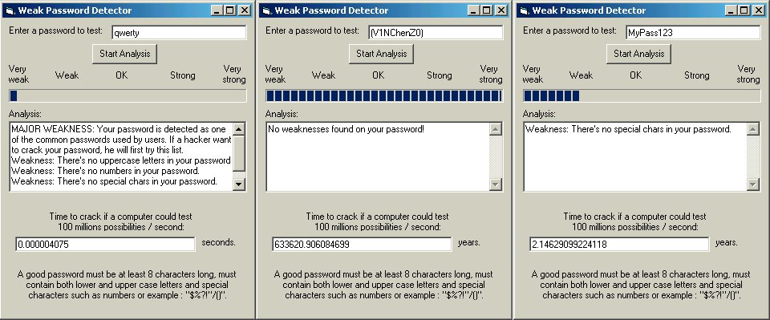



## Weak Password Detector 2\.0 \(Updated\)

### Description

(Updated version) Now with common list of passwords database and customized analysis.

With the fast growing of the Internet, the use of passwords has become very important for all of us. But not a lot of people uses strong password (which mean it cannot be easily cracked). So I made this utility to test your passwords to see if they are strong. You just have to enter a password and the program will tell you how is it strong and it will also tell how much time it would take to crack this password. Note: You can customize the parameters in the program for your needs. Fully commented.

You will surely be suprised of the results.

NOTE: Please vote on Weak Password Detector 2.1 (in the code of the month section) please!
 
### More Info
 

             |
---                |---
**Submitted On**   |2000-08-31 19:29:58
**By**             |[Vincent Bouret](https://github.com/Planet-Source-Code/PSCIndex/blob/master/ByAuthor/vincent-bouret.md)
**Level**          |Intermediate
**User Rating**    |4.6 (32 globes from 7 users)
**Compatibility**  |VB 5\.0, VB 6\.0
**Category**       |[Internet/ HTML](https://github.com/Planet-Source-Code/PSCIndex/blob/master/ByCategory/internet-html__1-34.md)
**World**          |[Visual Basic](https://github.com/Planet-Source-Code/PSCIndex/blob/master/ByWorld/visual-basic.md)
**Archive File**   |[CODE\_UPLOAD94788312000\.zip](https://github.com/Planet-Source-Code/vincent-bouret-weak-password-detector-2-0-updated__1-11105/archive/master.zip)

